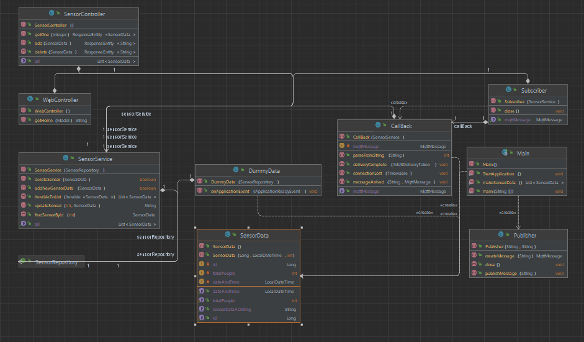

# Entrance Data

- This is a project in the course IDATA2304 Computer Communication and Network Programming.

## Table of content overview:
- [Abstract](#abstract)
- [Introduction](#introduction)
- [Theory and technology](#theory-and-technology)
- [Methodology](#methodology)
- [Results](#results)
- [Discussion](#discussion)
- [Conclusion](#conclusion-and-future-work)
- [References](#references)

---
## Abstract
This application was created to satisfy one of several demands to complete the course IDATA2304 Computer networks and network programming at NTNU Aalesund 2022, by group 7. It aims to successfully upload data to a server and display it on a website of our own creation.

The entrance of a building can be quite crowded. It can be hard for an individual to keep up with the number of people that are always entering. Staring at the camera for hours can be quite tiresome as well and requires a lot of attention. Problems like burglary when entered at a suspicious time, how many people entered the building and so on can arise. The solution for this project is to check how many people passed by the sensor, at what time, the date they passed through and how many people there are in total. This gives organizations and supervisors the ability to have control over people entering their building. We have created a prototype system, which is described in this report. We have made a system which makes it easier for the organizations to organize the data. They will get information about when people are entering, how many and so on. Possible future research includes design of an application on the phone, making it easier to access everywhere. Perhaps giving them a heads up when people are entering at unusual times.

---
## Introduction

Our solution can be used in several places, like private homes, finance and all types of organizations. Basically, all types of buildings need statistics over people.

Our project is meant to be an application that sends data when someone has either left/entered the building. This can be used by a shopping center, to see how many people always enter or leave the center. It can also be used with the fire station, to get an overview of how many people are in the building at a given time in case of a fire.

The problems in this environment can be that employees, students or other people are entering at unusual times. This could either be that they forgot something, planning to burn the building down or that they are planning to steal. Either way, it is good for a supervisor to know. It is relevant because this can lead to dangerous and unwanted actions.

First, we will go into what types of protocols we used. After that, we will show the results and describe how the work process went. Eventually, we will discuss our solution and give a conclusion. In conclusion we will go into what we can do, to improvise and make the system better.

---
## Theory and technology

- Java is the programming language used in this project. The reason is all the members of the group know the programming language the best.

- HTML Hypertext Markup Language is a markup language for documents designed to be displayed in a web browser. HTML is important because the application was chosen to create our website using HTML.

- HTTP or Hypertext Transfer Protocol is an application-level protocol which is being used for our web communication between webserver and web client. HTTP uses port 80. This is relevant for the solution since it uses a local webserver to display the website, hence the need for HTTP communication.

- Underlying protocols for HTTP are TCP, TLS if HTTPS is used, DNS if the need to have a domain name and public webserver, UDP for DNS, and IP.

- GET is used to request data over HTTP. The application uses GET from the HTTP protocol to fetch the HTML file so it could display the data from the database on the website.

- IP is a unique global address. Used to ensure data is sent to the correct recipient. This is being used in our project due to communication with an MQTT server on the public network. Therefore, the need for an IP since our solution works over the internet.

- If IP was not used, and MAC-addresses was used instead, it would not be able to communicate outside the local area network (LAN). This would destroy the IoT solution since the user cannot access data easily and everywhere.

- TCP or Transmission Control Protocol is a network level protocol. The application uses TCP to send the data to and from the server. It is important because it is needed to be sure that the packets are being transported reliably.

- However, If TCP was not used and UDP was used instead. We would not know if there was sensor data missing. Meaning TCP ensures reliable data transfer, so we know only one message will be received for each message sent by a sensor. This is important for the solution because it needs every entrance and exit for each person in a building recorded/logged in the database.

- MQTT is an application layer protocol which implements a subscriber listener model for distributing information (ibm 2022). The application utilizes MQTT-client to establish a connection with the MQTT server/broker. MQTT also makes sure that there are listeners who will receive the messages sent by publisher. MQTT uses port 1883. This is useful for the solution since the users want to send/publish data from their sensors, and then use a listener/subscriber to fetch, format and then store the data in the database.

![Figure 1, Wireshark screenshot showing how TCP is used to establish and maintains connection to MQTT broker, and MQTT message and [ACK].](src/main/resources/Images/wireshark.png)

- Spring framework is a programming and configuration model for Java (Spring 2022). This is being used because it makes it easier to store data in a database.

- Thymeleaf is a server-side Java template engine for web and standalone environments (thymeleaf 2022). The application uses Thymeleaf to correctly display the data in our database in browser using HTML.

- MySQL is used to create and manage our database. This is crucial for the solution since it is needed to store the data somewhere to be able to analyze and use this data on the website later. MySQL uses port 3306.

- JSON or JavaScript Object Notation is the file format. This is used for the application because the data is stored in the MySQL database in JSON format.

- JavaScript is used to have a smooth and interactive website.

- Other subjects have also been connected to the project. These subjects are: IDATA2303 Data modelling and databases and ISTA1003 Statistics. We use a database to store and present data, and we use some statistics on the data we have stored in our database, presenting the statistics as a graph on our website for visualization.
---

## Methodology
The methodology agile has been used for this project. First, the group sat down to figure out what the project should be based on, and ideas around the project (brainstorming). After that the workload was split into phases, meaning for every phase there was some work to do as a team for each phase. As a team the whole group worked together, or in pairs. The group helped each other when needed, motivated and pushed each other to work, so the final product could be good.

The following design principles were used: responsibility driven design, cohesion, coupling and modularization to get a well-designed application.

When planning the project, the initial thought was to use a microcontroller with sensors, but it was later decided against in the final decision. This was because we had no prior experience with microcontrollers/sensors and therefore used way too much time to figure it out and then decided to drop it. Instead, the decision was to use simulated sensor data within our application. This decision was to show that our application works in practice, and later it could implement live sensors sending data if there was time left.

In addition, there was also another decision to have a local project, where the database, webserver and everything is on the local machine. This was due to getting a working solution. Afterwards, the application would get published on a public network. 

---

## Results

Our application creates its own dummy data to demonstrate its functionality. The data is stored utilizing the spring framework crud interface so it can be stored in our database, which makes it easier to access for Spring. Thymeleaf is used to connect HTML to Java. 

The application generates its own dummy data in a way which is not realistic when taking the available sensor nodes into consideration. Since the node does not have an internal clock, it would not be able to provide the time of the recorded movement. The application does not currently support having sensors at multiple locations as all recorded data is assumed to be from the same location. It does, however, support multiple sensors for the same location. The business logic is robust and well designed in a way which makes it easy to integrate in the rest of our applications. 

Our project has two applications. The first is to publish sensor data to the MQTT-broker and the second is to run the whole application which subscribes to the MQTT-broker and fetches data, formatting the data, then stores it in our database, displaying it to our website.

For the excellence work the following have been added:

*	A simple working database. This database stores sensor data (dummy data for now) sent by our simulated sensor in a single table. This data be accessed and displayed.
*	Sensor data is being displayed on a website using HTML, CSS and JavaScript.
*	The display includes graphs with some statistics of the sensor data.

---

## Discussion

The application can send and receive data via MQTT, which was the main task. MQTT- callback will give the user a heads-up if the connection gets lost for some reason. In addition, the data is added to a database and visualized on a monotone website. 

However, physical sensors were not used in this project, so the data is not true to real life, partly because of unrealistic data generation. They are simulated in Java. 

Given more time changing the way we generate data would be a priority. Either by making a sensor node or refactoring the dummy data generation.

After the data is generated however, we have a well-functioning and robust application which does what we want it to do. It both sends and receives data without issue and displays it in a manner which is easy to read. If the sensor itself would provide accurate data our application would easily be able to provide solutions to every problem we aimed to solve.

Although we are happy with our website, it might not be a part of a final product if we were to deliver a finished product to a customer. Never the less it is useful in demonstrating that the application works, and in part, how it works. 

If we where to improve one aspect of the website it would be automatically updating it in real time for the users without them having to refresh.

We have a simple user interface to start the application in either subscriber or publisher mode, but this should not be necessary as the publisher should always be a sensor node. This is just for convenience.

--- 

## Conclusion and future work

Our project has a database, website, simulated sensor, and MQTT-client. These work together to form our application alongside our business logic. We present our sensor data on our website using the data in the database. We are sending data from our simulated sensor to MQTT and using a subscriber node on the MQTT-server to fetch and store the sensor data in our database. 

Further work would be implementing physical sensors that can send data to be stored in our database. These sensors would be placed in each entrance/exit of the building we would want to monitor. We would also implement multi building surveillance, meaning you could monitor multiple buildings with the application. Where sensors are connected to each building, to distinguish them in the data. 

We would also like to implement a mobile application for our solution. This would make it so you could monitor or check data you are interested in, for example how many people went into the building on a specific day, or week, and do it all from your mobile phone. 

---

## References

ibm. 2022. ibm.com. 12 06. Accessed 12 06, 2022. https://www.ibm.com/docs/en/ibm-mq/7.5?topic=SSFKSJ_7.5.0/com.ibm.mq.javadoc.doc/WMQMQxrClasses/org/eclipse/paho/client/mqttv3/package-summary.html.

Spring. 2022. spring.io/projects/spring-framework. 12 06. Accessed 12 06, 2022. https://spring.io/projects/spring-framework.

thymeleaf. 2022. thymeleaf.org. 11 17. Accessed 06 12, 2022. https://www.thymeleaf.org/.

---
